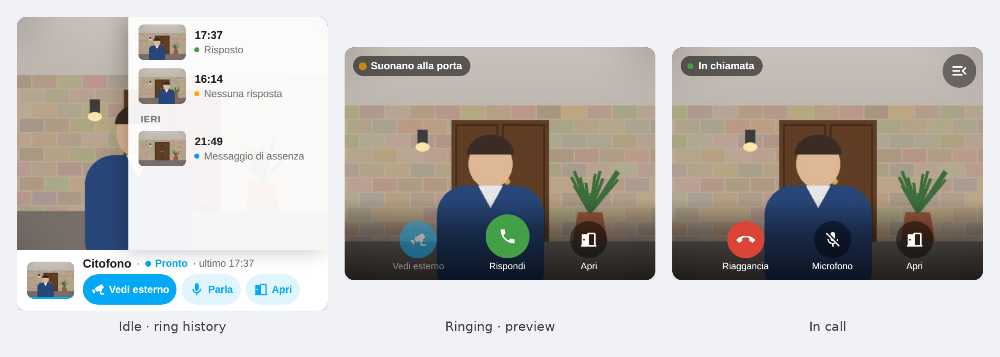

# Vimar Intercom — Integrazione Home Assistant

[](https://github.com/hacs/integration)

🇬🇧 *[Read this page in English](README.md)*

Integra il videocitofono **Vimar Elvox** (2 Fili Plus / IP / 2FV2) in Home Assistant: ricevi lo
squillo, apri la porta/cancello, guarda la camera **su richiesta**, comanda **segreteria** e
**non disturbare**, e usa gli **attuatori** del tuo impianto (F1/F2, luci scala, relè) come bottoni.

> **Come funziona davvero.** Questa integrazione **non** usa RTSP. Implementa uno **stack SIP
> custom in Python/asyncio** che emula l'app ufficiale **Vimar VIEW** ("TOGA"): stesso `User-Agent`,
> stessi header identità (`Mobile-IMEI`, `MyName`) e l'header proprietario **`Panda`**. Parla o con
> il **Flexisip locale sul Tab** (UDP :5060) o con il **cloud Vimar in TLS** (SRV `_sips._tcp`).
> Il video arriva **on‑demand** dalla chiamata SIP (RTP H.264, servito al componente stream di Home
> Assistant come MPEG‑TS su `/api/vimar_intercom/av`), non da uno stream RTSP sempre attivo.
> Mentre suona, l'integrazione chiede un'anteprima video (early media SIP), quindi camera e foto
> mostrano chi c'è prima che qualcuno risponda.

---

## Compatibilità

Sviluppata su **Elvox Tab 7S 2F+ WiFi (art. 40507)**. Anche gli altri Tab Vimar 2F / 2FV2 / IP
dovrebbero funzionare — la configurazione arriva dal QR di abbinamento — e la tabella qui sotto
riporta quello che è stato effettivamente segnalato finora.

| Modello | Art. | Impianto | Firmware | Connessione | Stato |
|---|---|---|---|---|---|
| Elvox Tab 7S 2F+ WiFi | 40507 | 2F | — | UDP locale | Piattaforma di sviluppo: squillo, chiamata, rispondi/riaggancia, apri porta, video on-demand, attuatori |
| Elvox Tab 5S UP 2 Wire WiFi | 40515 | 2FV2 | 2.1.0203 | TLS cloud | Funzionante, segnalato da @CPietro — vedi note sotto |
| Elvox Tab 5S UP 2 Wire WiFi | 40515 | — | — | TLS cloud | Registrazione cloud OK dopo la fix 1.0.1, segnalato da @gtarraran992 ([#1](../../issues/1)) |

**Cosa cambia da impianto a impianto.** Le due segnalazioni sui Tab 5S, messe accanto all'impianto di
sviluppo, portano alla stessa conclusione pratica: *conta l'indirizzo a cui mandi il comando, e quanto
il Tab ti racconta di ritorno*.

- **I comandi di stato vanno all'SGA.** Sull'impianto di sviluppo (40507 / 2F) `VOICEMAIL;ON|OFF` e
  `DND;ON|OFF` funzionano se inviati all'SGA — lì `55001`, preso da `SYSTEM.MAGIC_APT_INTERCOM` della
  rubrica. Mandati altrove (l'indirizzo del Tab stesso, il gruppo appartamento, il vecchio default
  `60001`) tornano un 200 OK senza effetto, o un 404. Se i tuoi switch sembrano morti, le opzioni
  SGA/PICG sono la prima cosa da controllare — vedi la tabella delle opzioni più sotto.
- **`GET_INIT_STATUS` risponde, ma con quantità di dettaglio diverse.** Sul 40507 la risposta è corta:
  `rubrica_ver`, `vm_ver`, `vm_level`, `dnd`, `voicemail`. Sull'impianto 40515 / 2FV2 è il payload
  completo — `dnd`, `voicemail`, `rubrica_ver`, `vm_ver`, `vm_level`, `vm_timeout`,
  `vm_timeout_values`, `apt_names`, `GID`, `media_enc` e un `token`. Per questo l'integrazione legge
  quello che trova e ignora quello che manca, invece di aspettarsi un insieme fisso.
- **La cifratura media è un valore dell'impianto**, non un default globale: il 40515 dichiara
  `media_enc: "srtp"`, mentre l'impianto di sviluppo rifiuta SRTP e lavora in RTP chiaro.
- Ancora aperto sul 40515: **la segreteria si accende ma non si spegne**, in corso di verifica da chi
  l'ha segnalato.

Se lo fai funzionare su un modello diverso, o sullo stesso con risultati diversi, apri una
[segnalazione di compatibilità hardware](../../issues/new?template=compatibility_report.yml) — anche
i casi in cui ha funzionato tutto al primo colpo sono utili quanto quelli in cui si è rotto qualcosa.

---

## Requisiti

- Home Assistant **2024.7** o successivo, Python 3.12+ (quello di HA 2024.7).
- ffmpeg sull'host HA (dipendenza dichiarata nel manifest) per la camera.
- Il **QR di abbinamento** dell'impianto Vimar (dall'app VIEW) **oppure** i parametri SIP manuali
  (id, password, domain, cloud proxy).
- Requisiti Python: solo `pycryptodome` e `requests` (nessuna libreria SIP esterna: lo stack è custom).

---

## Installazione

### Via HACS
1. HACS → Integrazioni → menu ⋮ → *Custom repositories* → aggiungi il repo come categoria *Integration*.
2. Installa **Vimar Intercom**.
3. Riavvia Home Assistant.

### Manuale
Copia `custom_components/vimar_intercom/` nella cartella `config/custom_components/` di HA e riavvia.

> **Nota per chi reinstalla/aggiorna a mano**: `__init__.py` e `sip_client.py` contengono patch
> locali sul logging (non presenti upstream — vedi sezione *Logging* più sotto). Se sovrascrivi
> questi file con una versione presa da un'altra fonte, riapplica le patch: senza HACS non c'è
> nulla che le preservi automaticamente.

---

## Configurazione

Impostazioni → Dispositivi e servizi → Aggiungi integrazione → **Vimar Intercom**.

- **QR** (consigliato): incolla il testo del QR di abbinamento Vimar; l'integrazione lo decodifica
  (`qr_decoder.py`: Base64(AESkey|AES‑CBC|IV) → coppie `KEY=VALUE`) e compila id, password, domain,
  cloud/local proxy, GID, MAC, planttype.
- **Manuale**: inserisci `sip_user`, `sip_password`, `sip_domain`, `cloud_proxy`.

**Trovato in rete** (dalla 1.0.12, [#6](../../issues/6)): il Tab si annuncia via mDNS
(`_eipvdes._tcp`, lo stesso servizio che cerca l'app VIEW) e Home Assistant lo propone tra i
*Rilevati*. Servono ancora il QR o le credenziali (l'annuncio non porta segreti), ma l'indirizzo del
citofono e il dominio SIP locale arrivano dal Tab stesso. Conta sugli impianti il cui QR dice
`domain=127.0.0.1`, come un 40515: per la registrazione locale si usa il dominio annunciato dal Tab
(il suo indirizzo) invece di quello cloud. Un citofono già configurato si riconosce dal MAC, e se il
DHCP gli dà un altro indirizzo l'integrazione lo segue (solo in modalità locale). Dove l'mDNS è
filtrato non cambia nulla: si aggiunge a mano come prima.

### Opzioni (dopo l'aggiunta)

Impostazioni → Vimar Intercom → **Configura**:

| Opzione | Descrizione |
|---|---|
| **IP del citofono** (`local_proxy`) | IP del Flexisip locale sul Tab |
| **Usa SIP UDP locale** (`use_local_udp`) | ON = UDP locale; OFF = TLS cloud |
| **Porta UDP locale** (`local_udp_port`) | default 5060 |
| **Attuatori (JSON)** (`actuators`) | lista JSON `{name, msg, target, icon}`; crea bottoni dinamici. Vuoto = nessun bottone |
| **SGA** (`sga_target`) | destinatario di `VOICEMAIL;`/`DND;`, e del comando di apertura se `door_target` è vuota. Vuoto = default `55001` |
| **PICG** (`picg_target`) | destinatario di `GET_INIT_STATUS`. Sull'impianto di sviluppo coincide con l'SGA, su altri no (60001 su un 40515). Vuoto = default `55001` |
| **Targa video** (`camera_target`) | targa chiamata dalla camera, da *Chiama* e da *Chiama Video (esterno)*: la riga `PHONEBOOK` con `TYPE='PE'`. **Non è l'SGA.** Vuoto = default `55100` |
| **Pannello interno** (`internal_panel_target`) | destinatario di *Chiama Casa (interno)*. La rubrica non lo dice: va inserito a mano. Vuoto = default `55002` |
| **Targa che apre la porta** (`door_target`) | destinatario del comando di apertura (serratura, *Apri Porta*, `open_door` senza `target`, attuatori con target `AUTO`): il `GID_PE` dell'attuatore porta nella rubrica. **Non sempre è l'SGA**: su un 2FV2 l'SGA è `61000` e la porta la apre la targa `55001`. Vuoto = la targa dell'attuatore porta salvato, altrimenti l'SGA |
| **Cartella foto squillo** (`snapshot_dir`) | dove salvare, a ogni squillo, la foto di chi suona (`squillo_AAAAMMGG_HHMMSS_mmm.jpg` + `ultimo_squillo.jpg`) e il clip dello squillo (`squillo_AAAAMMGG_HHMMSS_mmm.mp4`: il video dell'anteprima, e della chiamata se si risponde da HA, fino a 60 s, senza audio), es. `/config/media/citofono`. Deve essere scrivibile da HA. Vuoto = disattivato |
| **Secondi per la foto migliore** (`snapshot_delay`) | la prima foto si salva appena arriva il primo fotogramma (~1 s dallo squillo); dopo questi secondi la sostituisce un fotogramma con l'esposizione regolata (il primo keyframe della targa è scuro). Default 3 (Tab 5S Up 40515), 0 = resta la prima |
| **Utenti ammessi** (`allowed_users`) | Limita la card, lo storico squilli (`GET /api/vimar_intercom/rings`, foto e clip) e `/audio_ws` a questi utenti HA. Gli amministratori sempre. Vuoto = ogni utente autenticato (default). **Non** è per utente per l'entità camera né per `/av` dalla rete locale (la camera di HA, go2rtc: senza token, solo rete locale): chi può aprire la camera vede e sente lo stream. Se la cartella foto è sotto una cartella media di HA (es. `/config/media/citofono`), foto e clip compaiono nel browser media per tutti gli utenti |
| **Messaggio di assenza** (`away_message_file`, `away_message_delay`) | file audio (mp3, wav…) fatto sentire al visitatore se nessuno risponde entro N secondi (0 = mai, max 60); poi l'integrazione riaggancia |
| **Messaggio di assenza da testo** (`away_message_text`, `away_message_tts`) | se il campo file è vuoto, questo testo lo legge la sintesi vocale di Home Assistant (`away_message_tts` = un'entità `tts.*`; vuoto = il motore predefinito di HA) nella lingua di HA, max 30 s. L'audio si genera all'avvio e resta in cache; se il TTS fallisce il citofono squilla come sempre |
| **Cifratura del media (SRTP)** (`media_enc`) | **Automatico** (default dalla 1.0.11): segue il `media_enc` che l'impianto dichiara nella risposta a `GET_INIT_STATUS` (`"srtp"` su un 40515 in cloud); gli impianti con la risposta corta (il 40507) restano in RTP chiaro. **Attivo** / **Disattivo** lo forzano. Chi aveva salvato «attivo» con la 1.0.10 o prima resta attivo; «spento» diventa automatico. Prova **Attivo** se la camera resta nera o la chiamata fallisce con `488` |
| **Webhook squillo** (`ring_webhook_url`, `ring_end_webhook_url`) | GET opzionale (fire-and-forget, timeout 5 s) inviata quando inizia uno squillo e quando finisce (risposto, annullato o non risposto) — es. gli URL `turnOn`/`turnOff` di un Dummy Switch Scrypted (vedi [docs/EXTERNAL.md](docs/EXTERNAL.md)). Un fallimento logga solo un warning, mai blocca lo squillo. Vuoto = disattivato |

Esempio, Tab 5S Up 40515 (Due Fili Plus, cloud): SGA `61000`, PICG `60001`, targa video e apri‑porta
`55001`. Sono i valori della rubrica dell'app VIEW, non i default.

Gli attuatori e i valori SGA/PICG si ricavano dalla **rubrica dell'impianto** (`rubrica.db`): dal menu
delle opzioni scegli **"Scarica la rubrica dal citofono"** (in LAN), **"Scarica la rubrica dal cloud
Vimar"** (impianti con la risposta lunga di `GET_INIT_STATUS`) oppure **"Importa attuatori da
rubrica.db"**, carica il file (lo trovi con l'app VIEW o via root, vedi `docs/RUBRICA.md`) e conferma — attuatori, SGA, PICG, targa video e targa che apre la porta vengono impostati in automatico.
In alternativa puoi inserire i valori a mano nello step "Impostazioni" (utile se conosci già l'SGA del
tuo impianto o vuoi modificare la lista attuatori prodotta dall'import).

---

## Entità

| Entità | Piattaforma | Descrizione |
|---|---|---|
| Intercom (Videocitofono) | `camera` | Video **on‑demand** (stream): aprendolo parte la chiamata SIP (non a una riconnessione entro 5 s dall'uscita dell'ultimo spettatore, per 60 s dalla fine di una chiamata: `/av` risponde 503; `/av` risponde 503 subito anche quando la chiamata che aspettava viene rifiutata o finisce, salvo con il WebSocket dell'app iOS collegato: allora aspetta fino a 25 s la chiamata dell'app); durante uno squillo mostra l'anteprima senza rispondere. Le foto sono istantanee in chiamata o durante lo squillo (fotogrammi completi, puliti), assenti altrimenti: le miniature non fanno mai squillare la targa |
| Doorbell (Campanello) | `event` | Entità `event` (device_class DOORBELL), event_type `ring`, allo squillo (INVITE in arrivo) |
| Serratura | `lock` | Apri porta (`OPEN_2F` → `door_target`); auto‑relock dopo 5 s (nessun feedback fisico) |
| Chiama | `button` | Chiamata SIP verso la targa di default |
| Chiama Video (esterno) / Chiama Casa (interno) | `button` | Chiamata verso `camera_target` / `internal_panel_target` |
| Rispondi / Riaggancia | `button` | Rispondi (200 OK) / termina (BYE) |
| Apri Porta | `button` | `OPEN_2F` verso `door_target` |
| *Attuatori dinamici* | `button` | Uno per voce in `options["actuators"]` (F1/F2, luci scala, relè…); invia `MSG` con `Panda: command` |
| Segreteria | `switch` | `VOICEMAIL;ON/OFF` (Panda: blue) verso l'SGA; stato letto dagli annunci del Tab e da `GET_INIT_STATUS`, chiesto dopo ogni comando. Il valore comandato si vede per 10 s al massimo: senza conferma lo stato diventa *sconosciuto* ([#9](../../issues/9)) |
| Non Disturbare | `switch` | `DND;ON/OFF` (Panda: blue) verso l'SGA; stesse regole della Segreteria |
| Ritardo segreteria | `select` | Solo sugli impianti con la risposta lunga di `GET_INIT_STATUS`: `vm_timeout`, uno dei `vm_timeout_values` dichiarati dall'impianto, scritto con `SET_APT_PARAMS` ([#4](../../issues/4)). Sugli impianti con la risposta corta non compare |
| Intercom SIP | `binary_sensor` | Registrazione SIP attiva (connectivity) |
| Intercom In Call | `binary_sensor` | Chiamata attiva |
| Intercom Squillo | `binary_sensor` | ON mentre una targa chiama (attr: chiamante) |
| Intercom Chiamata In Uscita | `binary_sensor` | ON mentre HA chiama |
| Intercom Stato | `sensor` (enum) | offline / idle / ringing / in_call / calling (+ attributi rete; sugli impianti con la risposta lunga anche il `GID` dell'appartamento, `apt_names` e il `media_enc` dichiarato) |
| Intercom Ultimo Chiamante | `sensor` | targa/monitor dell'ultimo squillo |
| Intercom Ultimo Squillo | `sensor` (timestamp) | ora dell'ultimo squillo (attr: chiamante, foto/foto_url e clip/clip_url con `snapshot_dir`) |
| Intercom Squilli | `sensor` (contatore) | squilli dall'avvio |
| Intercom Chiamate | `sensor` (contatore) | chiamate connesse |
| Intercom Durata Ultima Chiamata | `sensor` (s) | durata ultima chiamata |
| Intercom Ultima Apertura | `sensor` (timestamp) | ultima apertura porta (attr: targa, esito, contatore) |
| Intercom Ultimo Comando | `sensor` | esito ultimo `send_command` |
| Intercom Ultimo Messaggio Ricevuto | `sensor` | ultimo SIP MESSAGE dal citofono |

---

## Card del citofono (audio bidirezionale)



*La card a riposo con la cronologia degli squilli, durante uno squillo (anteprima video prima di rispondere) e in chiamata. L'immagine della telecamera è una scena dimostrativa.*

L'integrazione include una card per le dashboard e la carica da sola: non va aggiunta tra le
Risorse. Si sceglie **Citofono Vimar** dall'elenco delle card (telecamera, nome, layout e
cronologia hanno l'editor visuale; il resto resta in YAML) oppure si scrive a mano:

```yaml
type: custom:vimar-intercom-card
# facoltativi, questi sono i valori predefiniti:
name: Citofono
camera: camera.vimar_intercom_intercom
status: sensor.vimar_intercom_intercom_stato
lock: lock.vimar_intercom_serratura
last_ring: sensor.vimar_intercom_intercom_ultimo_squillo
anchor: citofono   # "" = disattivato
history: 8         # 0 = disattivato
layout: overlay    # oppure "sotto"
```

Aprire la card non chiama mai la targa. Il video dal vivo parte solo durante lo squillo o una
chiamata. Senza video la card è una riga sola: la foto dell'ultimo squillo, nome, stato, ora
dell'ultimo squillo e i tre pulsanti. Col video compare il riquadro 4:3; `layout` decide dove
stanno i pulsanti durante la diretta:

- `overlay` (predefinito): la card *è* il video. Stato in alto a sinistra, cronologia in alto a
  destra, pulsanti su una fascia scura in fondo all'immagine.
- `sotto`: il video sta sopra la riga, i pulsanti restano nella riga sotto; niente copre
  l'immagine.

Dopo il riaggancio l'ultima immagine resta 1,5 s con i pulsanti spenti, così un secondo tocco
non finisce su quello che risale quando la card si restringe. **Vedi esterno** chiama la targa
video; la visione dura quanto la concede la targa (circa 10 s sul Tab 5S Up 40515), poi il video
finisce e la card si richiude. Per guardare di nuovo si ripreme **Vedi esterno**, come sul
monitor di casa. I pulsanti cambiano con lo stato:

| Stato | Pulsanti |
|---|---|
| a riposo | Vedi esterno, Parla, Apri |
| squillo | —, Rispondi (risponde e apre il microfono), Apri |
| in collegamento | Annulla, Microfono (solo per spegnerlo), Apri (l'etichetta conta i secondi; dopo 20 s avvisa che la targa non risponde) |
| in chiamata | Riaggancia, Microfono (acceso/spento), Apri |

Ogni pulsante resta al suo posto: chiamata a sinistra, voce al centro, porta a destra, così un
tocco non finisce su un pulsante appena cambiato. Se chiamata, risposta o apertura falliscono,
l'errore prende il posto della riga di stato per qualche secondo. **Apri** vuole due tocchi
entro 3 s. Durante lo squillo non c'è un pulsante per rifiutare: lo squillo finisce da solo, e
un tocco sbagliato manderebbe via chi ha suonato.

L'audio passa da `/api/vimar_intercom/audio_ws`, lo stesso canale dell'app iOS: PCM a 8 kHz nei
due sensi, con la cancellazione dell'eco del browser. Il browser concede il microfono solo in
**HTTPS** (o su localhost); in HTTP semplice il pulsante Parla è spento (il suggerimento dice
perché) e il resto funziona comunque.

**Video.** In HTTPS, sui browser con WebCodecs (Chrome, Edge, Firefox, Safari e iOS dalla
16.4), la card decodifica l'H.264 della targa dallo stesso WebSocket e lo disegna su un canvas:
il primo fotogramma compare circa 0,1 s dopo che la targa lo manda, senza aprire lo stream di
HA. Altrove (HTTP semplice, Safari vecchi) ripiega sullo stream della telecamera di HA, che
parte in 2-4 s.

**Link diretto.** Se l'URL della pagina finisce con `#citofono` (opzione `anchor`) la card si
porta in vista da sola, es. `/lovelace/camera#citofono` come azione al tocco di una notifica di
squillo.

**Ultimi squilli.** Con la cartella foto (`snapshot_dir`) impostata, la foto dell'ultimo squillo
sulla riga è il tasto della cronologia (in chiamata il tasto sta sul video): gli ultimi squilli
(opzione `history`, predefinito 8) con foto, ora ed esito: *Risposto* (risposto da HA),
*Messaggio di assenza*, *Nessuna risposta* (nessuna risposta da HA; anche uno squillo risposto
dal Tab finisce qui). Un tocco sulla foto la apre in grande; uno squillo col clip ha il tasto
play sulla miniatura e il tocco fa partire il video al posto della foto. La foto compare circa
un secondo dopo lo squillo e dopo `snapshot_delay` la sostituisce quella migliore; il clip a
squillo (o chiamata) finiti. L'integrazione tiene l'elenco in `squillo.json` accanto ai file
(ultimi 200 squilli). Senza cartella non c'è cronologia. Per le notifiche, il sensore
«Intercom Ultimo Squillo» porta `foto` / `clip` (percorsi su disco) e `foto_url` / `clip_url`
(URL relativi, che l'app companion scarica col suo login) appena ogni file esiste.

---

## Servizi (`services.yaml`)

| Servizio | Descrizione | Campi |
|---|---|---|
| `vimar_intercom.send_command` | SIP MESSAGE arbitrario (per test). Solo amministratori e automazioni | `body`, `target`, `header_name`, `header_value` |
| `vimar_intercom.call` | Chiamata SIP verso una targa/monitor | `target` |
| `vimar_intercom.answer` | Risponde alla chiamata in arrivo | — |
| `vimar_intercom.hangup` | Termina la chiamata attiva | — |
| `vimar_intercom.open_door` | Comando di apertura (`OPEN_2F`; solo comandi `OPEN` / `OPEN_*`); senza `target` va a `door_target` | `target`, `command` |
| `vimar_intercom.fetch_local` | GET HTTP Digest verso l'interfaccia locale del Tab (home mode). Solo amministratori e automazioni | `path`, `save_as`, `host`, `scheme` |
| `vimar_intercom.find_sga` | Cerca il PICG interrogando una serie di indirizzi ([#14](../../issues/14)). Solo amministratori e automazioni | `start`, `end`, `targets`, `probe`, `delay`, `reply_wait`, `sip_timeout`, `apply`, `apply_sga` |
| `vimar_intercom.simulate_ring` | Squillo di prova (admin): fa scattare l'evento campanello e le tue automazioni, senza la targa | — |

Esempio (Strumenti per sviluppatori → Azioni):

```yaml
action: vimar_intercom.send_command
data:
  body: OPEN_2F
  target: "55001"
  header_name: Panda
  header_value: command
```

**Trovare SGA/PICG senza la rubrica** (1.0.13, per gli impianti solo cloud dove non funziona né lo
scaricamento in LAN né quello dal cloud): `find_sga` interroga un indirizzo alla volta (default
`55000`–`55010`, al massimo 50) e si ferma alla prima `GET_NICKS_REPLY`; la voce con ruolo `PICG` è la
risposta. Non cambia nulla, salvo `apply` (scrive `picg_target`) e/o `apply_sga` (scrive anche
`sga_target`); poi l'integrazione si ricarica.

```yaml
action: vimar_intercom.find_sga
data:
  start: "55000"
  end: "55010"
response_variable: result
```

Se un impianto lascia `GET_NICKS` senza risposta SIP (segnalato su un 40515 in cloud: `Timeout` dove
`GET_INIT_STATUS` riceveva `200`), usa `probe: get_init_status`: dà i tre esiti puliti, e l'indirizzo la
cui sonda provoca la `GET_INIT_STATUS_REPLY` è il PICG; ma all'SGA vero fa comparire «Configurazione
appartamento modificata» sull'app a ogni invio. `sip_timeout` (default 8 s) limita l'attesa della
risposta SIP di ogni sonda. La risposta elenca ogni sonda con il suo esito: `absent` (404), `exists`
(accettata, nessuna reply), `replied`, `no_response`, `error`; più `picg` e i nickname dichiarati.

---

## Eventi

Il campanello è esposto come **entità `event`** (`event.<...>_doorbell`, event_type `ring`), non come
evento sul bus. Nelle automazioni usa un trigger di stato sull'entità `event` (o sul binary_sensor squillo).

In più, dai `MESSAGE` in arrivo dal Tab, l'integrazione emette sul bus HA:
`vimar_intercom_missed_call`, `vimar_intercom_videomessage`, `vimar_intercom_fuoriporta`,
`vimar_intercom_call_info`, `vimar_intercom_phonebook_changed`. Solo lettura, nessun comando in
uscita. Trigger di esempio:

```yaml
automation:
  - alias: "Citofono - Chiamata persa"
    trigger:
      - platform: event
        event_type: vimar_intercom_missed_call
    action:
      - service: notify.mobile_app_telefono
        data: { message: "Chiamata persa al citofono" }
```

---

## Automazioni di esempio

Il file `packages/vimar_intercom.yaml` (da copiare in `config/packages/`) contiene un'automazione
"squillo → notifica" basata sul cambio di stato dell'entità `event`, più un riaggancio di sicurezza
che chiude una chiamata rimasta aperta per due minuti:

```yaml
automation:
  - alias: "Citofono - Squillo → notifica"
    trigger:
      - platform: state
        entity_id: event.vimar_intercom_doorbell
    action:
      - action: notify.mobile_app_IL_TUO_TELEFONO
        data:
          title: "🔔 Qualcuno al citofono"
          message: "Squillo delle {{ now().strftime('%H:%M:%S') }}."
          data:
            image: "/api/camera_proxy/camera.vimar_intercom_intercom"
```

`camera.snapshot` funziona durante una chiamata o uno squillo. Per avere la foto di ogni visitatore non
serve un'automazione: imposta **Cartella foto squillo** nelle opzioni. Prova le tue automazioni con
`vimar_intercom.simulate_ring`. Non puntare una `camera: platform: ffmpeg` su `/api/vimar_intercom/av`:
blocca Home Assistant finché la sonda di ffmpeg non scade.

**Scrypted (campanello Alexa, Echo Show), go2rtc, Frigate**: usa
`/api/vimar_intercom/av?autocall=0&idle=image`, uno stream continuo che non chiama mai la targa
(immagine di standby a riposo, video dal vivo durante squilli e chiamate; `?autocall=0` da solo
risponde invece 503 a riposo), e inoltra l'`event` del campanello con un'automazione. Istruzioni
in [`docs/EXTERNAL.md`](docs/EXTERNAL.md) (in inglese).

In `docs/lovelace_example.yaml` c'è una card Lovelace di base con i pulsanti rispondi / apri porta /
riaggancia. Il riquadro del video mostra il video dal vivo durante una chiamata o uno squillo. Per
parlare usa la card del citofono qui sotto.

## Cambiamenti di comportamento nella 1.0.9

- La camera non chiama mai la targa da sola a una riconnessione: per 60 s dopo la fine di una
  chiamata, di un auto-call fallito o di un'anteprima guardata, una riapertura di `/av` entro
  5 s dall'uscita dell'ultimo spettatore (go2rtc, stream worker di HA) riceve 503 invece di una
  chiamata nuova. Aprire la camera più tardi (dashboard, HomeKit) chiama come prima.
- Lo squillo riceve `183 Session Progress` con il nostro SDP (early media) invece di
  `180 Ringing`: la targa manda il video prima che qualcuno risponda. Un secondo INVITE mentre
  siamo occupati riceve `486`, non `603`; il secondo ramo di uno squillo biforcato riceve `482`.
- La risposta H.264 rispecchia l'offerta della targa (payload type, `packetization-mode`,
  `profile-level-id`); la nostra offerta propone entrambi i modi (96 mode 1, 97 mode 0).
- La view MJPEG `/api/vimar_intercom/video` non c'è più; `/av` e `/audio_ws` sono invariati.
- In UDP locale il SIP è accettato dall'indirizzo del citofono e dagli host del dialogo in corso
  (Contact/Via dello squillo, Contact della chiamata), da nessun altro.

## Limiti noti

- **Audio bidirezionale solo dalla card del citofono**: il lettore video di HA non ha microfono, quindi
  rispondere da un pulsante, da una notifica o da Alexa prende la chiamata in silenzio. Per parlare
  usa `custom:vimar-intercom-card`, in HTTPS.
- **Anteprima allo squillo**: serve che l'impianto mandi early media (verificato su un Tab 5S Up
  40515 via cloud); altrimenti anteprima e foto dello squillo restano vuote finché qualcuno non
  risponde.
- **Impianti solo‑cloud** (es. Tab 5S Up 40515): il Tab risponde `503 You're not allowed` a qualsiasi
  richiesta SIP in LAN, quindi la modalità UDP locale lì non può funzionare; usa il cloud TLS.
  L'interfaccia HTTP locale del Tab (:80) può accettare il TCP e poi restare muta, quindi non c'è
  rubrica da leggere in LAN; camera, attuatori, apri‑porta e i comandi di stato funzionano lo
  stesso via SIP.
- **Segreteria/DND**: si comandano attraverso l'**SGA** (`SYSTEM.MAGIC_APT_INTERCOM` della rubrica,
  `55001` sull'impianto di sviluppo). Inviati a qualunque altro indirizzo vengono ignorati in
  silenzio: azzeccare l'SGA è ciò che li fa funzionare — impostalo in Options o lascialo riempire
  dall'import di `rubrica.db`.
- **Rubrica cloud**: serve un `token`. Gli impianti che rispondono al `GET_INIT_STATUS` in forma lunga
  lo consegnano direttamente, e a quel punto la rubrica si scarica con una sola richiesta autenticata —
  vedi `docs/RUBRICA.md` §0-bis, verificato su un 40515. Dalla 1.0.12 lo fa il menu delle opzioni:
  **"Scarica la rubrica dal cloud Vimar"** ([#5](../../issues/5)); il token si rilegge dall'impianto ogni
  volta e non viene salvato. Gli impianti che rispondono in forma corta (compreso quello di sviluppo) non
  hanno il token: lì si usa lo scaricamento dal citofono in LAN, o l'estrazione manuale.
- **Attuatori By‑me** (es. luci scala di domotica By‑me): potrebbero non rispondere via SIP anche se elencati in rubrica.
- **Lock**: nessun feedback fisico di stato (auto‑relock ottimistico dopo 5 s).
- **Squillo durante una nostra chiamata**: mentre Home Assistant chiama la targa o è in chiamata,
  un INVITE in arrivo riceve `486 Busy Here` e non genera l'evento campanello: sul campo non si
  distingue ancora dall'eco della nostra chiamata fatto dal PBX. Uno squillo subito dopo il BYE
  della targa è uno squillo normale.
- **Rubrica**: su impianti solo‑cloud va estratta una tantum (vedi `docs/RUBRICA.md`); l'import automatico via cloud dipende da un token provisionato dall'account.

---

## Logging

Il componente tiene un buffer circolare interno (`_debug_log`, in `__init__.py`) per la propria
diagnostica, e per riempirlo alza il proprio logger a `DEBUG`. Di base questo farebbe propagare
ogni riga `DEBUG` anche al log di Home Assistant, scavalcando il livello impostato in `logger:`
nella `configuration.yaml` (i logger Python propagano al root).

Patch applicata: il logger `custom_components.vimar_intercom` resta a `DEBUG` per il buffer interno,
ma con `propagate = False`; un handler dedicato inoltra al log HA solo gli eventi `WARNING` e oltre.
Risultato: diagnostica interna intatta, log HA pulito.

**"Stale response 407" nel keepalive SIP**: l'OPTIONS periodico (`_send_options_ping` in
`sip_client.py`) non registra il proprio Call-ID tra le risposte attese, quindi la risposta del
proxy (tipicamente un `407`) veniva loggata come `WARNING "Stale response ..."` anche se è l'esito
normale del keepalive. `_dispatch_message` ora riconosce i Call-ID con prefisso `ping-` e li logga
a `DEBUG` invece che `WARNING`. Con questa fix + quella sopra, **non serve più** alcun filtro
`logger:` in `configuration.yaml` per silenziare questi messaggi.

**Limite noto**: il compromesso vale in entrambe le direzioni. Poiché il componente tiene il proprio
logger a `DEBUG` e inoltra solo `WARNING` e oltre, impostare
`logger: logs: custom_components.vimar_intercom: debug` in `configuration.yaml` **non** farà comparire
le righe `DEBUG` di questo componente nel log di Home Assistant: si leggono da
`/api/vimar_intercom/debug`. Rendere configurabile il livello inoltrato è nella lista delle cose da
fare.

Se aggiorni `__init__.py` o `sip_client.py` da una fonte esterna (non HACS, non versionato per
questo componente), ricontrolla che entrambe le patch siano ancora presenti (vedi nota in
*Installazione → Manuale*).

---

## Sicurezza

- Credenziali SIP (password/`ha1`) memorizzate **cifrate** nella config entry di HA, mai in chiaro nel repo.
- Endpoint HTTP interno: `/av` è filtrato **solo LAN** (`_is_local_request`); il WebSocket
  `/audio_ws` richiede autenticazione HA, e le sue azioni di debug (`command`, `probe`, `scan`,
  `register`, `reconnect`) sono riservate agli amministratori. Il payload del QR non viene loggato
  a livello INFO.
- Parlare su `/audio_ws?voice_answer=1` mentre squilla risponde alla chiamata (RMS del microfono sopra soglia
  per 200 ms): così rispondono Echo Show e HomeKit via Scrypted. Senza il flag, o su una connessione
  che era in chiamata finché non torna a riposo, la voce non risponde mai. A riposo l'audio si butta.
- Ultimi squilli per la card: `GET /api/vimar_intercom/rings` (elenco, `?limit=` fino a 50) e
  `GET /api/vimar_intercom/rings/<nome>` (la foto o il clip, anche a pezzi con Range) richiedono
  l'autenticazione HA (la card li carica con percorsi firmati). Il secondo serve solo file
  `squillo_AAAAMMGG_HHMMSS[_mmm].jpg` / `.mp4` dentro `snapshot_dir`, nient'altro (nemmeno un
  clip ancora in scrittura); la cartella non viene mai esposta sotto `/local`.
- In modalità UDP locale i pacchetti SIP che non arrivano dal citofono vengono scartati: un altro
  dispositivo in LAN non può simulare uno squillo.
- Nessuna dipendenza cloud obbligatoria in modalità UDP locale.

---

## Contribuire

Vedi [CONTRIBUTING.md](CONTRIBUTING.md) (in inglese). In breve: mai indovinare comandi o token SIP (un
token attuatore sbagliato può aprire fisicamente una porta), niente credenziali nel repo né nei log
che alleghi, `pytest` verde prima di aprire una PR, e indica sempre su che hardware hai provato.

---

## Disclaimer

Progetto **non affiliato né approvato da Vimar S.p.A.**. "Vimar", "Elvox", "VIEW" sono marchi dei
rispettivi proprietari. L'utente fornisce le proprie credenziali del proprio impianto.

## Licenza

**MIT** — © [Noise Heroes](https://github.com/noiseheroes-lab) (progetto upstream) e contributori del fork.
